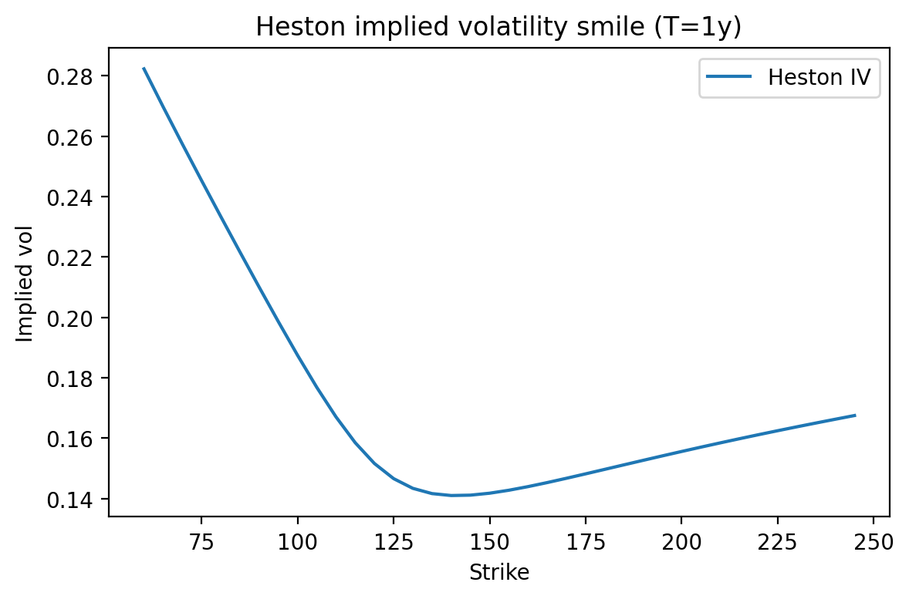
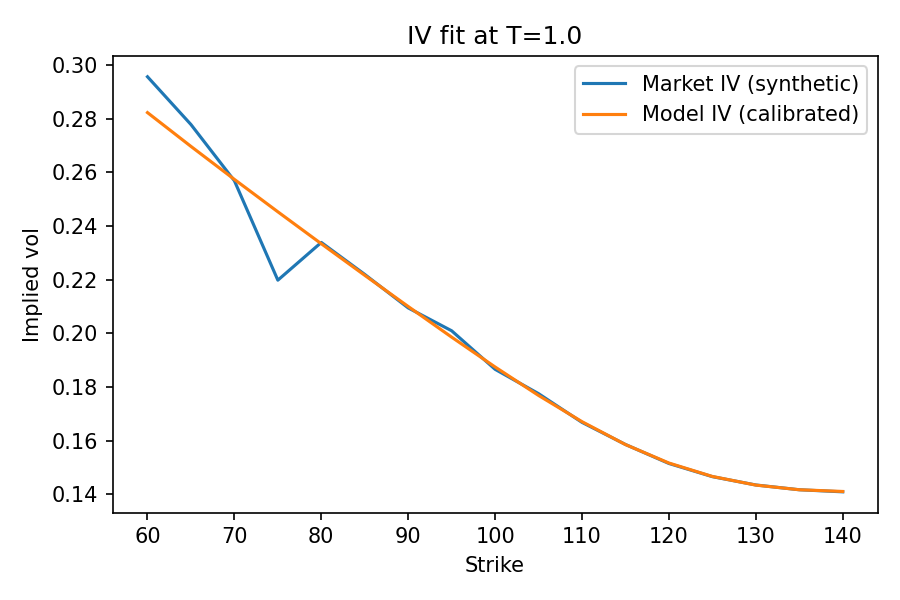
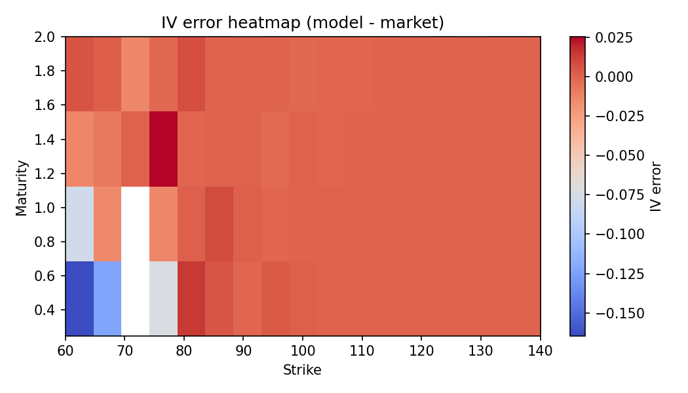
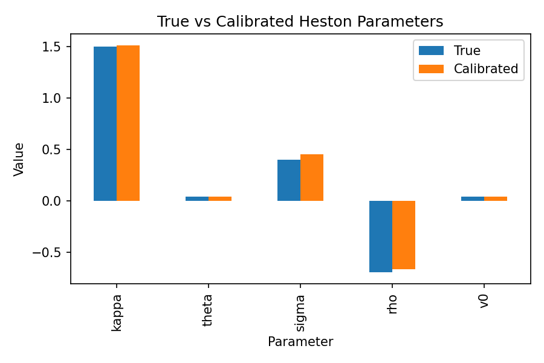

# Heston Stochastic Volatility: Pricing & Calibration

This project implements the **Heston stochastic volatility model** end-to-end, including European option pricing, implied volatility inversion, and parameter calibration on synthetic option surfaces.  
The emphasis is on **numerical correctness, robustness, and diagnostics**, closely reflecting real-world quant research and model-validation workflows.

---

## Features

- **Heston option pricing**
  - Semi-closed-form pricing via characteristic-function integration
  - Stable “Little Heston Trap” formulation
  - No-arbitrage price bounds validation

- **Implied volatility inversion**
  - Robust Black–Scholes implied volatility solver
  - Automatic clipping to arbitrage bounds
  - Stable behavior for deep ITM / OTM options

- **Calibration**
  - Calibration to synthetic option surfaces (price or IV target)
  - CLI and notebook-based workflows
  - Accurate recovery of true parameters under controlled noise

- **Diagnostics & validation**
  - Black–Scholes limiting-case test (constant-vol regime)
  - True vs calibrated parameter comparison
  - Relative calibration error (basis points)
  - IV fit plots and IV error heatmaps across strikes and maturities

- **Reproducibility**
  - Unit tests for pricing, simulation, and calibration
  - Calibration results saved with metadata (seed, noise, target, timestamp)

---

## Project Structure

```text
src/
  models/        # Heston and Black–Scholes pricing
  calibration/   # Calibration objective, optimizer, CLI
  utils/         # IV inversion, diagnostics, helpers

notebooks/
  01_heston_pricing.ipynb
  02_calibration_synthetic.ipynb
  03_calibration_report.ipynb

reports/
  figures/       # All plots used in the report
  main.tex       # LaTeX report
  calibration_result.json
```

---

## Example Results

### Heston implied volatility smile (T = 1y)


### IV fit after calibration (synthetic data)


### IV error heatmap (model − market)


### Parameter recovery (synthetic calibration)


---

## Calibration Summary (Synthetic Study)

- All Heston parameters are recovered accurately from synthetic data
- Relative calibration errors are small and visualized in basis points
- Minor local IV mismatches are expected due to noise and IV inversion sensitivity
- The Feller condition may be violated without numerical instability, which is common in practice

---

## Usage

### Install dependencies
```bash
python -m venv .venv
source .venv/bin/activate
pip install -r requirements.txt
```

### Run calibration via CLI
```bash
python -m src.calibration.calibrate --synthetic --seed 42 --target iv
```

### Run tests
```bash
pytest -q
```

### Explore notebooks
Run notebooks in order:
1. `01_heston_pricing.ipynb`
2. `02_calibration_synthetic.ipynb`
3. `03_calibration_report.ipynb`

---

## Notes on Model Risk

- Calibration is performed on **synthetic data** for validation purposes
- Real-market calibration requires bid/ask handling and weighting schemes
- The Heston model may not fit all maturities simultaneously without extensions
  (e.g. jumps or time-dependent parameters)

---

## Author

**Mohamad ElMahdi Houmani**  
MSc Physics — RWTH Aachen University

This project was developed as a quantitative research and model-validation exercise.